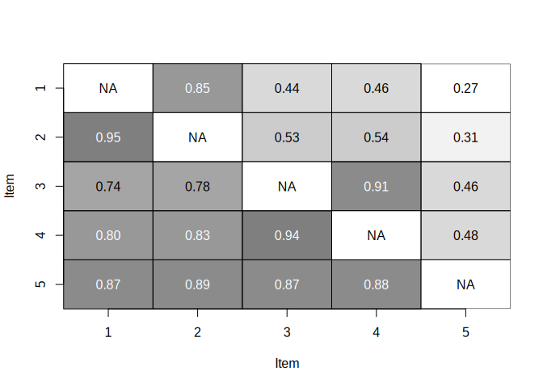

Analysis for Titz: Are psychologists constructing their scales in the
right way…
================
Johannes Titz
04/27/2023

- [Part I: Theory](#part-i-theory)
  - [Prepare](#prepare)
  - [Generate Data](#generate-data)
  - [Plot](#plot)
  - [FA model](#fa-model)
- [Part II: Empirical Example](#part-ii-empirical-example)
  - [Violations](#violations)
  - [unidim analysis](#unidim-analysis)
  - [FA](#fa)
  - [plot](#plot-1)

This analysis accompanies the paper: Titz, J. Are psychologists
constructing their scales in the right way? Insights from studying
perfect unidimensionality.

# Part I: Theory

## Prepare

I use librarian to manage dependencies, so please install it if you do
not have it yet (uncomment the first line).

``` r
# install.packages("librarian")
library(librarian)
shelf(partitions, pbapply, tidyverse, psych, johannes-titz/zysno, xtable, Matrix, plot.matrix)
# use multiple cores
cores <- round(parallel::detectCores() * 0.8)
# create vectors from phi matrix
vec_from_tbl <- function(a, b, c, d) {
  mtrx <- matrix(c(a, b, c, d), ncol = 2)
  v1 <- rep(c(0, 1), colSums(mtrx))
  v2 <- rep(c(0, 1), rowSums(mtrx))
  cbind(v1, v2)
}
```

## Generate Data

``` r
n <- 200
# all combos, even the ones where phi is NA
grid <- as.matrix(t(compositions(n = n, m = 4)))
colnames(grid) <- paste0("Var", 1:4)
# rowwise does not work with the following code, I do not know why
# multiple cores seem to give no advantage, so is not used (argument cl)
# we cache this manually as it takes some time
grid <- xfun::cache_rds({
  grid <- as_tibble(grid) %>%
    rowwise() %>%
    mutate(errors = Var3,
           expected_errors = (Var1 + Var3) * (Var3 + Var4) / (Var1+ Var2+ Var3+ Var4),
           h = 1 - errors / expected_errors)
  phi <- pbapply(grid[, 1:4], 1, function(x) phi(x, digits = 4))
  cbind(grid, phi)
}, file = "sim1", rerun = F)
grid <- as_tibble(grid)
```

``` r
grid_unidim <-  grid %>%
  filter(Var3 == 0) # only unidimensional
grid_row <- grid %>%
  filter(phi >= 0, Var2 >= Var3) # error cell is b
```

## Plot

``` r
p <- ggplot(grid_row, aes(phi, h)) + 
  #geom_point(alpha = 0.05) +
  geom_hex(bins = 100, show.legend = FALSE) + 
  theme_classic() +
  scale_x_continuous("Phi", breaks = seq(0, 1, 0.1)) + 
  scale_y_continuous("H", breaks = seq(0, 1, 0.1) ) + 
  coord_fixed()
p
```

<!-- -->

``` r
pdf("plots/phiH.pdf", width = 5, height = 5)
p
dev.off()
```

    ## png 
    ##   2

## FA model

It is not hard to create unidimensional model that results in a perfect
bifactor solution with factor analysis (for Pearson Correlation):

``` r
m1 <- vec_from_tbl(10, 80, 0, 10)
m2 <- vec_from_tbl(11, 78, 0, 11)
m3 <- vec_from_tbl(15, 70, 0, 15)

d <- cbind(m1, m2, m3[, -2])
# check that it is really unidimensional
zysnotize(d)
```

    ## $error_matrix
    ##      [,1] [,2] [,3] [,4] [,5]
    ## [1,]    0    0    0    0    0
    ## [2,]    0    0    0    0    0
    ## [3,]    0    0    0    0    0
    ## [4,]    0    0    0    0    0
    ## [5,]    0    0    0    0    0
    ## 
    ## $expected_error_matrix
    ##        [,1]   [,2]     [,3]     [,4]     [,5]
    ## [1,]  81.00  81.00  88.1100  88.1100 114.7500
    ## [2,]  81.00  81.00  88.1100  88.1100 114.7500
    ## [3,]  88.11  88.11  95.8441  95.8441 124.8225
    ## [4,]  88.11  88.11  95.8441  95.8441 124.8225
    ## [5,] 114.75 114.75 124.8225 124.8225 162.5625
    ## 
    ## $scalability_matrix
    ##      [,1] [,2] [,3] [,4] [,5]
    ## [1,]    1    1    1    1    1
    ## [2,]    1    1    1    1    1
    ## [3,]    1    1    1    1    1
    ## [4,]    1    1    1    1    1
    ## [5,]    1    1    1    1    1
    ## 
    ## $scalability
    ## [1] 1
    ## 
    ## $sum_errors
    ## [1] 0
    ## 
    ## $sum_expected_errors
    ## [1] 2016.858

``` r
ncol <- ncol(d)
colnames(d) <- paste("Item", seq(ncol(d)))
f1 <- factanal(d, 1)
f2 <- factanal(d, 2)

f1$loadings
```

    ## 
    ## Loadings:
    ##        Factor1
    ## Item 1 0.950  
    ## Item 2 0.119  
    ## Item 3 0.997  
    ## Item 4 0.125  
    ## Item 5 0.839  
    ## 
    ##                Factor1
    ## SS loadings      2.632
    ## Proportion Var   0.526

``` r
f2$loadings
```

    ## 
    ## Loadings:
    ##        Factor1 Factor2
    ## Item 1 0.950          
    ## Item 2         0.946  
    ## Item 3 0.997          
    ## Item 4         0.993  
    ## Item 5 0.837          
    ## 
    ##                Factor1 Factor2
    ## SS loadings      2.617   1.886
    ## Proportion Var   0.523   0.377
    ## Cumulative Var   0.523   0.900

``` r
print(xtable::xtable(cbind(f1$loadings, f2$loadings), label = "tab:fa1b", 
                     caption = "Cross tables of five unidimensional items"),
      file = "tables/fa1b.tex", booktabs = TRUE)

combs <- Map(function(x, y) table(d[, x], d[, y]),
             rep(1:ncol, each = ncol), rep(1:ncol, ncol))
lower <- seq(1, 21, 5)
upper <- seq(5, 25, 5)
res <- Map(function(x, y) Reduce(cbind, combs[x:y]),
    lower, upper)
res2 <- Reduce(rbind, res)
colnames(res2) <- paste0("$", rep(1:5, each = 2), "_", c(0, 1), "$")
rownames(res2) <- paste0("$", rep(1:5, each = 2), "_", c(0, 1), "$")

res2
```

    ##       $1_0$ $1_1$ $2_0$ $2_1$ $3_0$ $3_1$ $4_0$ $4_1$ $5_0$ $5_1$
    ## $1_0$    90     0    10    80    89     1    11    79    85     5
    ## $1_1$     0    10     0    10     0    10     0    10     0    10
    ## $2_0$    10     0    10     0    10     0    10     0    10     0
    ## $2_1$    80    10     0    90    79    11     1    89    75    15
    ## $3_0$    89     0    10    79    89     0    11    78    85     4
    ## $3_1$     1    10     0    11     0    11     0    11     0    11
    ## $4_0$    11     0    10     1    11     0    11     0    11     0
    ## $4_1$    79    10     0    89    78    11     0    89    74    15
    ## $5_0$    85     0    10    75    85     0    11    74    85     0
    ## $5_1$     5    10     0    15     4    11     0    15     0    15

``` r
print(xtable::xtable(res2, label = "tab:fa1",
                     caption = "Example of factor analysis for five unidimensional items"),
      booktabs = TRUE,
      file = "tables/fa1.tex",
      sanitize.text.function = function(x) {x})
```

# Part II: Empirical Example

Load data

``` r
dorig <- read.csv2("data.csv")
d <- dorig %>%
  select(id, item_nmbr, correctness) %>%
  pivot_wider(names_from = item_nmbr, values_from = correctness)
```


    Find order, calculate socre, show df


    ```r
    o <- order(colMeans(d[,-1]), decreasing = TRUE)
    d <- d[, c(1, o+1)]
    d$score <- rowSums(d[, -1])
    df <- as.data.frame(d)
    df[order(df$score), ]

    ##      id     1     4     3     2     5 score
    ## 13   13 FALSE FALSE FALSE FALSE FALSE     0
    ## 22   22 FALSE FALSE FALSE FALSE FALSE     0
    ## 46   46 FALSE FALSE FALSE FALSE FALSE     0
    ## 51   51 FALSE FALSE FALSE FALSE FALSE     0
    ## 54   54 FALSE FALSE FALSE FALSE FALSE     0
    ## 57   57 FALSE FALSE FALSE FALSE FALSE     0
    ## 64   64 FALSE FALSE FALSE FALSE FALSE     0
    ## 66   66 FALSE FALSE FALSE FALSE FALSE     0
    ## 73   73 FALSE FALSE FALSE FALSE FALSE     0
    ## 80   80 FALSE FALSE FALSE FALSE FALSE     0
    ## 85   85 FALSE FALSE FALSE FALSE FALSE     0
    ## 94   94 FALSE FALSE FALSE FALSE FALSE     0
    ## 97   97 FALSE FALSE FALSE FALSE FALSE     0
    ## 99   99 FALSE FALSE FALSE FALSE FALSE     0
    ## 101 101 FALSE FALSE FALSE FALSE FALSE     0
    ## 104 104 FALSE FALSE FALSE FALSE FALSE     0
    ## 116 116 FALSE FALSE FALSE FALSE FALSE     0
    ## 121 121 FALSE FALSE FALSE FALSE FALSE     0
    ## 123 123 FALSE FALSE FALSE FALSE FALSE     0
    ## 127 127 FALSE FALSE FALSE FALSE FALSE     0
    ## 17   17  TRUE FALSE FALSE FALSE FALSE     1
    ## 40   40  TRUE FALSE FALSE FALSE FALSE     1
    ## 41   41 FALSE FALSE FALSE FALSE  TRUE     1
    ## 70   70  TRUE FALSE FALSE FALSE FALSE     1
    ## 100 100  TRUE FALSE FALSE FALSE FALSE     1
    ## 108 108 FALSE FALSE  TRUE FALSE FALSE     1
    ## 2     2  TRUE  TRUE FALSE FALSE FALSE     2
    ## 5     5  TRUE  TRUE FALSE FALSE FALSE     2
    ## 7     7  TRUE  TRUE FALSE FALSE FALSE     2
    ## 8     8 FALSE FALSE  TRUE  TRUE FALSE     2
    ## 9     9  TRUE  TRUE FALSE FALSE FALSE     2
    ## 15   15  TRUE  TRUE FALSE FALSE FALSE     2
    ## 18   18  TRUE  TRUE FALSE FALSE FALSE     2
    ## 26   26  TRUE  TRUE FALSE FALSE FALSE     2
    ## 29   29  TRUE  TRUE FALSE FALSE FALSE     2
    ## 34   34  TRUE  TRUE FALSE FALSE FALSE     2
    ## 37   37  TRUE  TRUE FALSE FALSE FALSE     2
    ## 45   45  TRUE  TRUE FALSE FALSE FALSE     2
    ## 56   56  TRUE  TRUE FALSE FALSE FALSE     2
    ## 61   61  TRUE  TRUE FALSE FALSE FALSE     2
    ## 65   65  TRUE  TRUE FALSE FALSE FALSE     2
    ## 74   74  TRUE  TRUE FALSE FALSE FALSE     2
    ## 76   76 FALSE FALSE  TRUE  TRUE FALSE     2
    ## 81   81  TRUE  TRUE FALSE FALSE FALSE     2
    ## 83   83  TRUE  TRUE FALSE FALSE FALSE     2
    ## 86   86  TRUE  TRUE FALSE FALSE FALSE     2
    ## 89   89  TRUE FALSE  TRUE FALSE FALSE     2
    ## 93   93  TRUE  TRUE FALSE FALSE FALSE     2
    ## 107 107  TRUE  TRUE FALSE FALSE FALSE     2
    ## 109 109  TRUE  TRUE FALSE FALSE FALSE     2
    ## 112 112  TRUE  TRUE FALSE FALSE FALSE     2
    ## 113 113  TRUE  TRUE FALSE FALSE FALSE     2
    ## 120 120  TRUE FALSE FALSE  TRUE FALSE     2
    ## 124 124  TRUE  TRUE FALSE FALSE FALSE     2
    ## 30   30 FALSE  TRUE  TRUE  TRUE FALSE     3
    ## 36   36  TRUE  TRUE FALSE  TRUE FALSE     3
    ## 47   47  TRUE  TRUE  TRUE FALSE FALSE     3
    ## 117 117  TRUE  TRUE FALSE FALSE  TRUE     3
    ## 129 129  TRUE  TRUE  TRUE FALSE FALSE     3
    ## 1     1  TRUE  TRUE  TRUE  TRUE FALSE     4
    ## 4     4  TRUE  TRUE  TRUE  TRUE FALSE     4
    ## 10   10  TRUE  TRUE  TRUE  TRUE FALSE     4
    ## 12   12  TRUE  TRUE  TRUE  TRUE FALSE     4
    ## 14   14  TRUE  TRUE  TRUE  TRUE FALSE     4
    ## 20   20  TRUE  TRUE  TRUE  TRUE FALSE     4
    ## 23   23  TRUE  TRUE  TRUE  TRUE FALSE     4
    ## 24   24  TRUE  TRUE  TRUE  TRUE FALSE     4
    ## 25   25  TRUE  TRUE  TRUE  TRUE FALSE     4
    ## 31   31  TRUE  TRUE  TRUE  TRUE FALSE     4
    ## 32   32  TRUE  TRUE  TRUE  TRUE FALSE     4
    ## 33   33  TRUE  TRUE  TRUE  TRUE FALSE     4
    ## 35   35  TRUE  TRUE  TRUE  TRUE FALSE     4
    ## 42   42  TRUE  TRUE  TRUE  TRUE FALSE     4
    ## 43   43  TRUE  TRUE  TRUE  TRUE FALSE     4
    ## 49   49  TRUE  TRUE  TRUE  TRUE FALSE     4
    ## 53   53  TRUE  TRUE  TRUE  TRUE FALSE     4
    ## 55   55  TRUE  TRUE  TRUE  TRUE FALSE     4
    ## 58   58  TRUE  TRUE  TRUE  TRUE FALSE     4
    ## 62   62  TRUE  TRUE  TRUE  TRUE FALSE     4
    ## 63   63  TRUE  TRUE  TRUE  TRUE FALSE     4
    ## 68   68  TRUE  TRUE  TRUE  TRUE FALSE     4
    ## 79   79  TRUE  TRUE  TRUE  TRUE FALSE     4
    ## 84   84  TRUE  TRUE  TRUE  TRUE FALSE     4
    ## 87   87  TRUE  TRUE  TRUE  TRUE FALSE     4
    ## 95   95  TRUE  TRUE  TRUE  TRUE FALSE     4
    ## 98   98  TRUE  TRUE  TRUE  TRUE FALSE     4
    ## 102 102  TRUE  TRUE  TRUE  TRUE FALSE     4
    ## 103 103  TRUE  TRUE  TRUE  TRUE FALSE     4
    ## 106 106  TRUE  TRUE  TRUE  TRUE FALSE     4
    ## 110 110  TRUE  TRUE  TRUE  TRUE FALSE     4
    ## 118 118  TRUE  TRUE  TRUE  TRUE FALSE     4
    ## 125 125  TRUE  TRUE  TRUE  TRUE FALSE     4
    ## 128 128  TRUE  TRUE  TRUE  TRUE FALSE     4
    ## 131 131  TRUE  TRUE  TRUE  TRUE FALSE     4
    ## 132 132  TRUE  TRUE  TRUE  TRUE FALSE     4
    ## 3     3  TRUE  TRUE  TRUE  TRUE  TRUE     5
    ## 6     6  TRUE  TRUE  TRUE  TRUE  TRUE     5
    ## 11   11  TRUE  TRUE  TRUE  TRUE  TRUE     5
    ## 16   16  TRUE  TRUE  TRUE  TRUE  TRUE     5
    ## 19   19  TRUE  TRUE  TRUE  TRUE  TRUE     5
    ## 21   21  TRUE  TRUE  TRUE  TRUE  TRUE     5
    ## 27   27  TRUE  TRUE  TRUE  TRUE  TRUE     5
    ## 28   28  TRUE  TRUE  TRUE  TRUE  TRUE     5
    ## 38   38  TRUE  TRUE  TRUE  TRUE  TRUE     5
    ## 39   39  TRUE  TRUE  TRUE  TRUE  TRUE     5
    ## 44   44  TRUE  TRUE  TRUE  TRUE  TRUE     5
    ## 48   48  TRUE  TRUE  TRUE  TRUE  TRUE     5
    ## 50   50  TRUE  TRUE  TRUE  TRUE  TRUE     5
    ## 52   52  TRUE  TRUE  TRUE  TRUE  TRUE     5
    ## 59   59  TRUE  TRUE  TRUE  TRUE  TRUE     5
    ## 60   60  TRUE  TRUE  TRUE  TRUE  TRUE     5
    ## 67   67  TRUE  TRUE  TRUE  TRUE  TRUE     5
    ## 69   69  TRUE  TRUE  TRUE  TRUE  TRUE     5
    ## 71   71  TRUE  TRUE  TRUE  TRUE  TRUE     5
    ## 72   72  TRUE  TRUE  TRUE  TRUE  TRUE     5
    ## 75   75  TRUE  TRUE  TRUE  TRUE  TRUE     5
    ## 77   77  TRUE  TRUE  TRUE  TRUE  TRUE     5
    ## 78   78  TRUE  TRUE  TRUE  TRUE  TRUE     5
    ## 82   82  TRUE  TRUE  TRUE  TRUE  TRUE     5
    ## 88   88  TRUE  TRUE  TRUE  TRUE  TRUE     5
    ## 90   90  TRUE  TRUE  TRUE  TRUE  TRUE     5
    ## 91   91  TRUE  TRUE  TRUE  TRUE  TRUE     5
    ## 92   92  TRUE  TRUE  TRUE  TRUE  TRUE     5
    ## 96   96  TRUE  TRUE  TRUE  TRUE  TRUE     5
    ## 105 105  TRUE  TRUE  TRUE  TRUE  TRUE     5
    ## 111 111  TRUE  TRUE  TRUE  TRUE  TRUE     5
    ## 114 114  TRUE  TRUE  TRUE  TRUE  TRUE     5
    ## 115 115  TRUE  TRUE  TRUE  TRUE  TRUE     5
    ## 119 119  TRUE  TRUE  TRUE  TRUE  TRUE     5
    ## 122 122  TRUE  TRUE  TRUE  TRUE  TRUE     5
    ## 126 126  TRUE  TRUE  TRUE  TRUE  TRUE     5
    ## 130 130  TRUE  TRUE  TRUE  TRUE  TRUE     5
    ## 133 133  TRUE  TRUE  TRUE  TRUE  TRUE     5

### Violations

``` r
is_monotonic <- function(x) {
  all(diff(as.numeric(x)) <= 0)
}

df$monotonic <- apply(df[, 2:6], 1, is_monotonic)
dg <- df[df$monotonic == FALSE, ]

dh <- dg[order(dg$score), ]
dh
```

    ##      id     1     4     3     2     5 score monotonic
    ## 41   41 FALSE FALSE FALSE FALSE  TRUE     1     FALSE
    ## 108 108 FALSE FALSE  TRUE FALSE FALSE     1     FALSE
    ## 8     8 FALSE FALSE  TRUE  TRUE FALSE     2     FALSE
    ## 76   76 FALSE FALSE  TRUE  TRUE FALSE     2     FALSE
    ## 89   89  TRUE FALSE  TRUE FALSE FALSE     2     FALSE
    ## 120 120  TRUE FALSE FALSE  TRUE FALSE     2     FALSE
    ## 30   30 FALSE  TRUE  TRUE  TRUE FALSE     3     FALSE
    ## 36   36  TRUE  TRUE FALSE  TRUE FALSE     3     FALSE
    ## 117 117  TRUE  TRUE FALSE FALSE  TRUE     3     FALSE

``` r
print(
      xtable::xtable(dh[, 2:7], caption = "Participant answers that violate unidimensionality", 
                     label = "tab:viol", digits = 0),
      booktabs = TRUE,
      file = "tables/viol.tex"
)
```

### unidim analysis

``` r
lv <- loevenize(as.matrix(d[, 2:6]))
lv
```

    ## $error_matrix
    ##    col
    ## row 1 2 3 4 5
    ##   1 0 1 4 3 1
    ##   2 1 0 4 3 1
    ##   3 4 4 0 2 2
    ##   4 3 3 2 0 2
    ##   5 1 1 2 2 0
    ## 
    ## $expected_error_matrix
    ##    col
    ## row         1         2        3        4         5
    ##   1  0.000000 19.360902 15.22556 14.84962  7.518797
    ##   2 19.360902  0.000000 18.27068 17.81955  9.022556
    ##   3 15.225564 18.270677  0.00000 30.88722 15.639098
    ##   4 14.849624 17.819549 30.88722  0.00000 16.240602
    ##   5  7.518797  9.022556 15.63910 16.24060  0.000000
    ## 
    ## $h_matrix
    ##    col
    ## row         1         2         3         4         5
    ##   1 0.0000000 0.9483495 0.7372840 0.7979747 0.8670000
    ##   2 0.9483495 0.0000000 0.7810700 0.8316456 0.8891667
    ##   3 0.7372840 0.7810700 0.0000000 0.9352483 0.8721154
    ##   4 0.7979747 0.8316456 0.9352483 0.0000000 0.8768519
    ##   5 0.8670000 0.8891667 0.8721154 0.8768519 0.0000000
    ## 
    ## $h
    ## [1] 0.8604662
    ## 
    ## $sum_errors
    ## [1] 23
    ## 
    ## $sum_expected_errors
    ## [1] 164.8346

``` r
1-c(23, 18, 12)/ lv$sum_expected_errors
```

    ## [1] 0.8604662 0.8907996 0.9271997

### FA

``` r
d_num <- apply(d[, c(-1, -7)], 2, as.numeric)
fa1 <- factanal(d_num, 1)
fa2 <- factanal(d_num, 2)

tab <- cbind(unclass(loadings(fa1)), unclass(loadings(fa2)))
print(
      xtable::xtable(tab, caption = "Factor analysis",
                     label = "tab:fa2", digits = 3),
      booktabs = TRUE,
      file = "tables/fa2.tex"
)
tab
```

    ##     Factor1   Factor1   Factor2
    ## 1 0.5043532 0.2243658 0.9147548
    ## 4 0.5830152 0.3340612 0.8422924
    ## 3 0.9396848 0.9025577 0.2639481
    ## 2 0.9607688 0.9221507 0.2805721
    ## 5 0.4941331 0.4560955 0.1890938

### plot

``` r
tab <- round(cor(d[, -c(1, 7)]), 2)

a <- tril(lv$h_matrix, -1) # strict lower triangular matrix (omit diagonals)
b <- triu(tab, 1) # strict upper triangular matrix
c <- a + b
diag(c) <- NA

pdf("plots/itempairs.pdf", width = 7, height = 7)
plot(as.matrix(c), fmt.cell='%.2f', main = "", key = NULL,
xlab = "Item", ylab = "Item", col = sapply(seq(1, 0, -0.1), gray, alpha = 0.5))
dev.off()
```

    ## png 
    ##   2

``` r
plot(as.matrix(c), fmt.cell='%.2f', main = "", key = NULL,
xlab = "Item", ylab = "Item", col = sapply(seq(1, 0, -0.1), gray, alpha = 0.5))
```

<!-- -->
